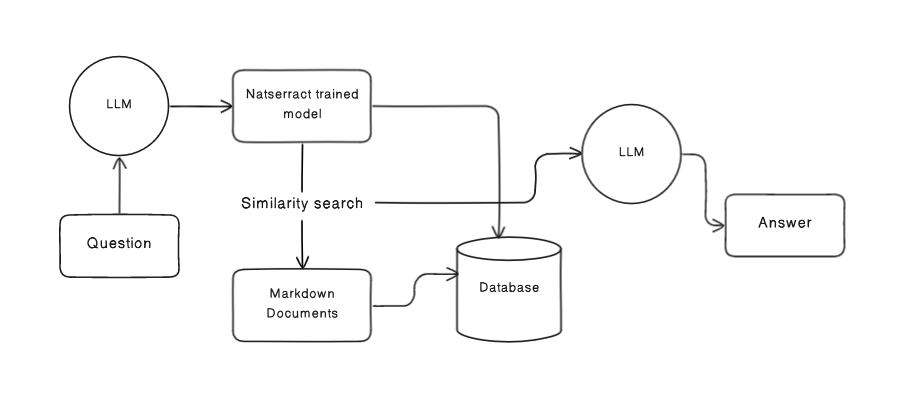

# Natserract AI
This repository contains code that demonstrates how to build AI assistant using Langchain, integrating GPT-4 from OpenAI. The assistant can handle question-answering (QA), provide various tools, similarity search with Doc2Vec approach, to provide answers to user queries based on the provided documents.

Throughout this journey, i use PostgreSQL as the main Database and PGVector extension to store the embeddings.

## Setup
Before running the script, you need to set up the required credentials and install the necessary libraries.

### Install Required Libraries
You can install the required libraries using poetry. Run the following command in your terminal or command prompt:
```sh
poetry install
```

### Install Spacy
```sh
python -m spacy download en_core_web_sm
```

### Setup API Keys
The script uses the OpenAI API key. You need to set these API keys as environment variables in your system. Replace OPENAI_API_KEY and GOOGLE_API_KEY with your actual API keys.

### Setup Database
- Postgres 15
- Enable the extension
  ```sql 
  CREATE EXTENSION vector;
  ```

## Running
```sh
poetry shell

poetry run python main.py
```

## Process


## Custom Datasets
Create `_datasets` directory and place all markdown the documents in it.

## Performance Considerations

If you need to perform this operation frequently and especially if the set of word vectors is large, it may be practical to use a database or a data store optimized for vector operations. These data stores can persist your word vectors and provide efficient similarity search functionality:

- FAISS by Facebook AI Research is a library for efficient similarity search and clustering of dense vectors.
- Elasticsearch has plugins like elasticsearch-vector-scoring to handle vector similarity.
- Annoy (Approximate Nearest Neighbors Oh Yeah) is a C++ library with Python bindings to search for points in space that are close to a given query point.

Using such systems can significantly speed up the similarity search process.